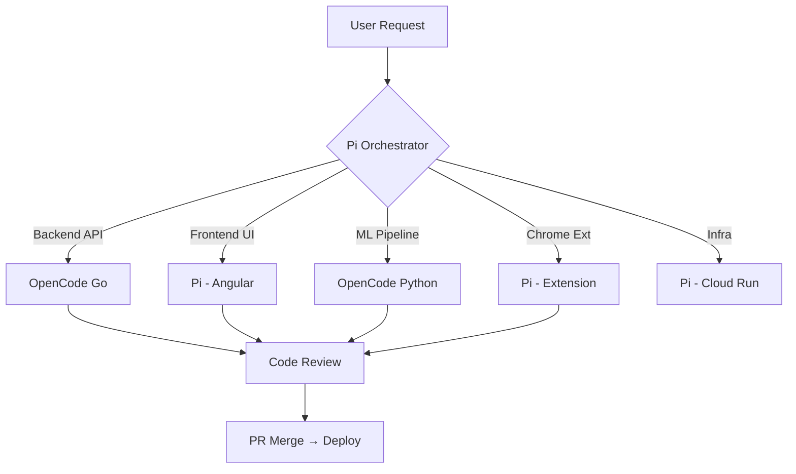

# Agente Workspace — Multi-Agent Configuration

## Agent Team

| Agent | Role | Platform | Stack |
|:------|:-----|:---------|:------|
| **Pi** | SDD Orchestrator + Frontend | Hermes Agent | Angular, Chrome Ext, Supabase |
| **OpenCode Go** | Backend + ML Executor | OpenCode CLI | Go 1.23, BigQuery, Cloud Run |
| **OpenCode Py** | Data + ML Pipeline | OpenCode CLI | Python, BQML, Gemma |

## Workflow



## SDD Phase Assignment

```
┌─────────────┬──────────────┬─────────────────────────────┐
│ SDD Phase   │ Agent        │ Tools                      │
├─────────────┼──────────────┼─────────────────────────────┤
│ Init        │ Pi           │ engram, skill-registry      │
│ Explore     │ Pi           │ codebase-inspection         │
│ Propose     │ Pi           │ cognitive-doc-design        │
│ Spec        │ Pi           │ cognitive-doc-design        │
│ Design      │ Pi           │ architecture-diagram        │
│ Tasks       │ Pi           │ work-unit-commits           │
│ Apply (Go)  │ OpenCode Go  │ go-testing, chained-pr     │
│ Apply (FE)  │ Pi           │ angular, chrome-extension  │
│ Apply (ML)  │ OpenCode Py  │ bqml, gemma               │
│ Verify      │ Pi           │ judgment-day, code-review  │
│ Archive     │ Pi           │ engram                     │
└─────────────┴──────────────┴─────────────────────────────┘
```

## Triggers

| Trigger | Agent | Action |
|:--------|:------|:-------|
| `/sdd-new` | Pi | SDD orchestration |
| `go build` | OpenCode Go | Go backend impl |
| `ng serve` | Pi | Angular frontend |
| `bq query` | OpenCode Py | ML + data pipeline |
| PR created | Pi | Code review |

## Configuration

```yaml
# ~/.hermes/config.yaml (relevant sections)
delegation:
  max_spawn_depth: 2
  max_concurrent_children: 3
  child_timeout_seconds: 600
  subagent_auto_approve: true
  provider: opencode-go
  model: deepseek-v4-flash
```

## Repos

| Repo | Agent Access | Purpose |
|:-----|:-------------|:--------|
| `Jerewergez/Agente_Workspace` | Pi + OpenCode Go | Main project |
| `Jerewergez/DevDBT` | Pi | BigQuery data lineage |
| `Jerewergez/Agente_Orquestador` | Pi | Atalaya watchdog |
| `Leoo2002/Front` | Pi | Angular frontend |
